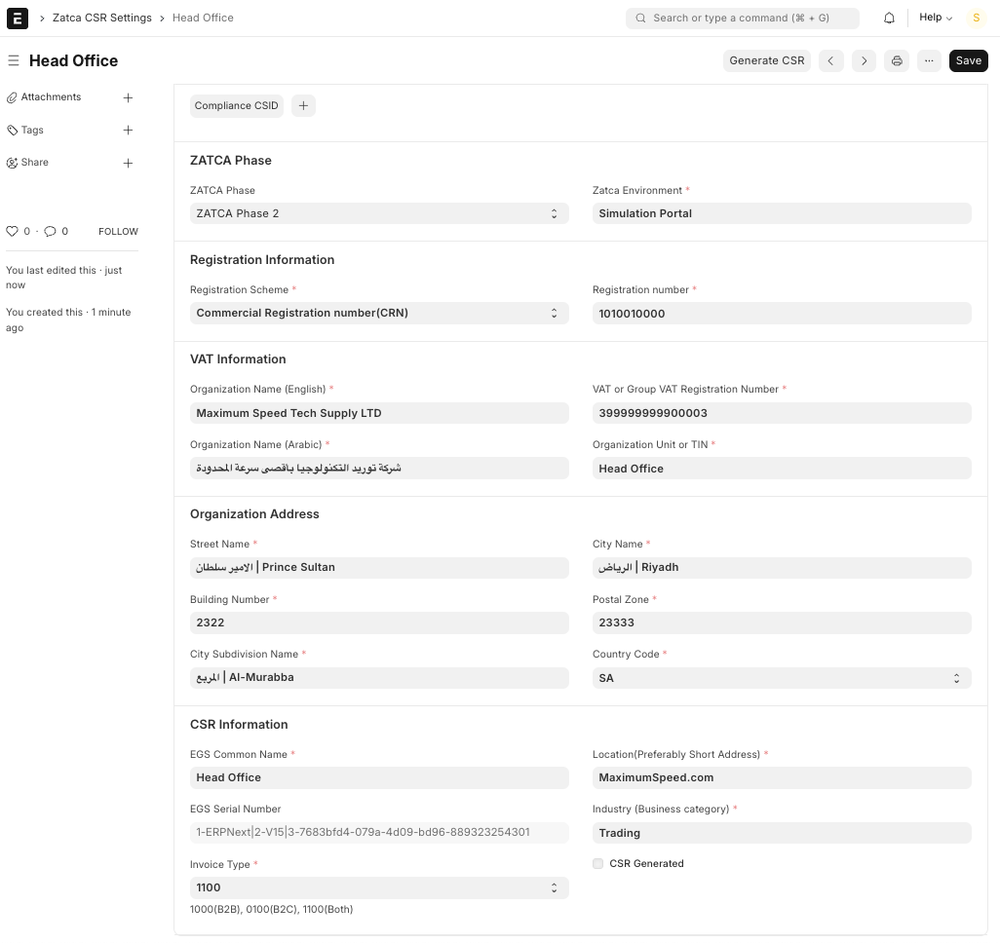
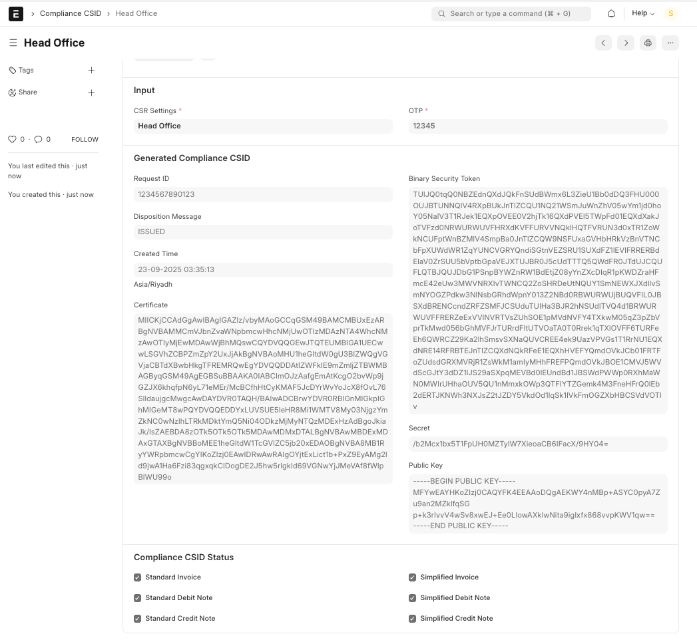
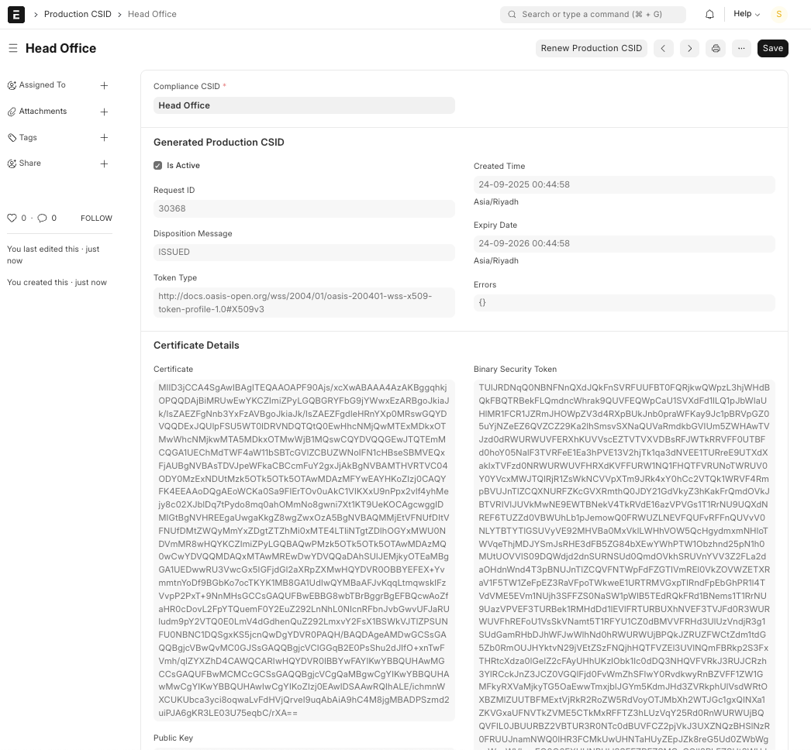
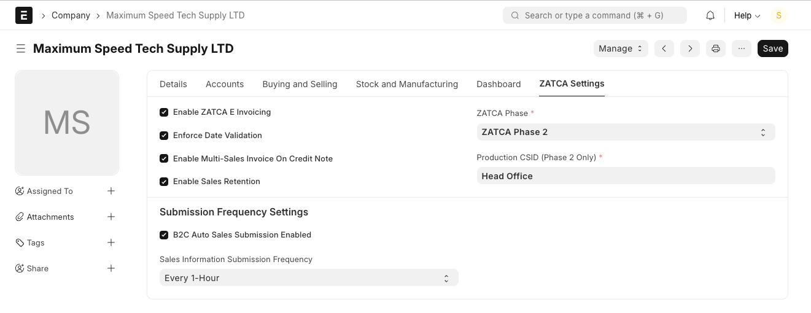
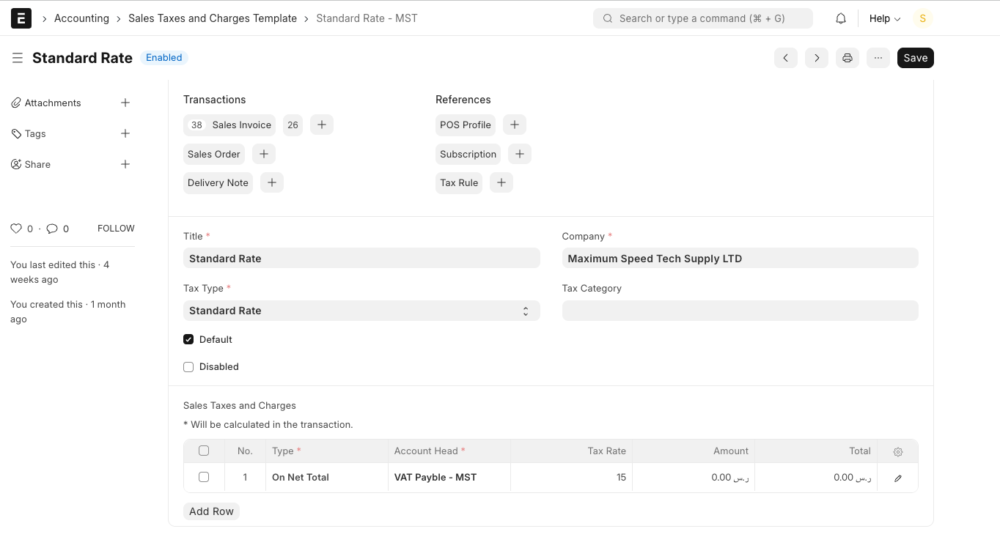
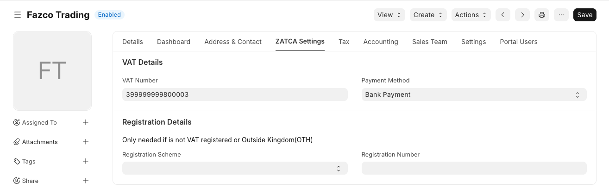
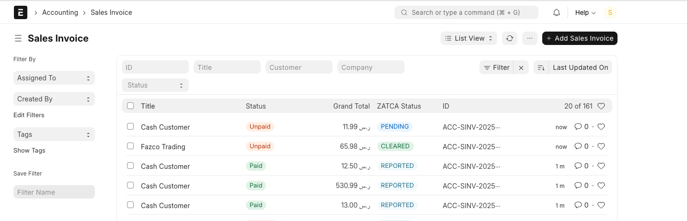
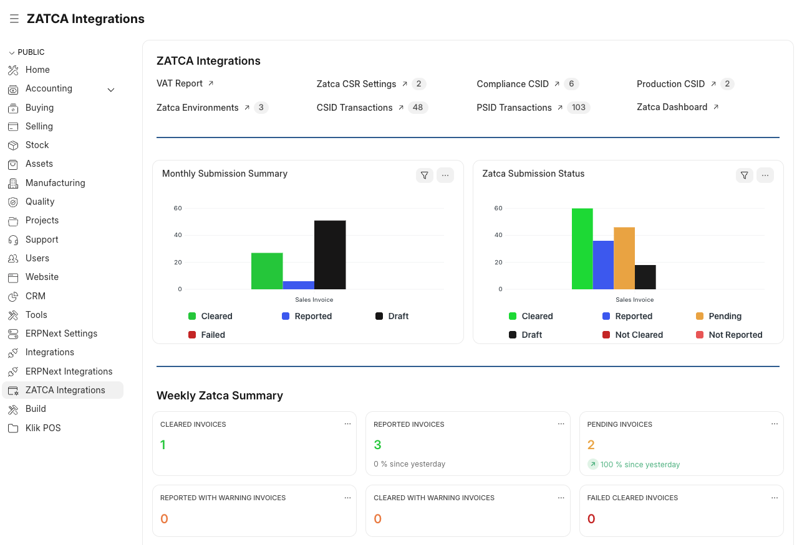

# 🇸🇦 ZATCA Integration for ERPNext

## Overview

This app delivers clean, powerful features that are simple to install and configure for Saudi Arabia's ZATCA e-invoicing compliance. Streamline your B2B clearance and B2C reporting workflows with automated XML generation, digital signing, and real-time ZATCA integration.

**Perfect for SMBs and enterprises** looking for reliable, easy-to-use ZATCA compliance without the complexity. No SDK downloads or complex setup required - just install, configure, and go live with foolproof ZATCA integration trusted by many enterprises and SMBs across the Kingdom.

## Key Features

### **📋 Invoice Management**
- **B2B Standard Invoices** - Complete clearance workflow for Business Customers (B2B)
- **B2C Simplified Invoices** - Reporting workflow for Individual Customers (B2C)
- **Credit Notes** - Credit note processing with ZATCA compliance (B2B and B2C)
- **Multi-Currency Support** - SAR and USD invoicing with currency conversion
- **Invoice Retention** - Retention management with ZATCA compliance (Fixed Amount OR Percentage)

### **🏢 Multi-Entity Support**
- **Multi-Company Operations** - Support for multiple entities with different VAT/CR numbers
- **Multi-Branch Configuration** - Branch-specific settings and operations with same or different CR
- **Data Validation** - Comprehensive validation before ZATCA submission for error-proof processing
- **Environment Management** - Fatoora Simulation and production environment support - test in simulation first and then enable production


### **⚡ Technical Features**
- **Real-time and Batch Processing** - Invoice clearance and reporting workflows in real-time, share your invoices with customers instantly
- **XML & QR Generation** - Automatic generation of compliant XML and QR codes with built-in print formats and email capabilities
- **Testing Environments** - Support for both ZATCA Simulation and Production portals
- **Audit Trail** - Complete tracking of all ZATCA requests and responses with detailes Tab in Sales invlice

### **📊 Tax Compliance**
- **Standard Rate (15%)** - VAT compliance for standard transactions
- **Zero Rate** - Export and qualifying zero-rated supplies
- **Exempt Rate** - Tax-exempt transactions with proper documentation
- **Customer Scenarios** - Local customers, international customers, VAT/non-VAT combinations

### **📈 Reporting**
- **VAT Reports** - VAT collected and payable reports
- **Sales Reports** - Sales reporting for tax filing purposes
- **Transaction Logs** - Detailed transaction history and status tracking
- **Built-in Print Formats** - Professional invoice templates ready for use

### **🌐 Cloud & Environment Support**
- **Frappe Cloud Optimized** - Fully compatible with Frappe Cloud hosting
- **Multiple ZATCA Environments** - Support for sandbox, simulation, and production
- **Environment Switching** - Easy migration from testing to live environments
- **Cloud-Native Architecture** - Built for scalability and performance

## 🔧 Quick Installation

### Prerequisites
- ERPNext v14+ or v15+
- Python 3.10+
- Valid ZATCA CSR and certificates

### Installation Steps

1. **Install the App**
   ```bash
   # Get the app
   bench get-app https://github.com/beverensoftware/zatca_integration.git

   # Install on your site
   bench --site [site-name] install-app zatca_integration
   ```

2. **Setup ZATCA Configuration**
   ```bash
   # Run setup wizard
   bench --site [site-name] migrate
   ```

3. **Configure Your Company**
   - Navigate to Company Settings
   - Enable ZATCA E-Invoicing
   - Upload your ZATCA certificates
   - Configure tax templates

### 🏗️ Development Setup

1. **Create Development Site**
   ```bash
   bench new-site zatca.local
   bench --site zatca.local install-app erpnext
   bench --site zatca.local install-app zatca_integration
   bench --site zatca.local add-to-hosts
   ```

2. **Development Commands**
   ```bash
   # Start development server
   bench start

   # Run migrations
   bench --site zatca.local migrate

   # Clear cache
   bench --site zatca.local clear-cache
   ```

## ⚙️ Configuration Guide

### 1. **Generate Production CSID**

#### Step 1.1: Provide Company Information (Generate CSR)
Enter your company registration details, tax information, and VAT number, then generate CSR.



#### Step 1.2: Create Compliance CSID  
From CSR, create Compliance CSID using OTP and validate CSID.



#### Step 1.3: Generate Production CSID
Generate Production CSID from validated Compliance CSID.



### 2. **Company Configuration**

  i. *Enable ZATCA E-Invoicing*  
Activates ZATCA Phase 2 integration for the company.  
Once enabled, all invoices will be validated according to ZATCA’s e-invoicing rules.

ii. *ZATCA Phase*  
Select which ZATCA Phase applies to your company. For ongoing compliance, choose **ZATCA Phase 2**.

iii. *Production CSID (Phase 2 Only)*
<br/>Enter the **Production CSID** that contains your ZATCA certificate.  
In sandbox/testing mode, this field may display **Sandbox**.  
In production, you must configure the official Production CSID to ensure invoices are legally valid.

iv. *Enforce Date Validation* 
<br/>Ensures that invoice dates strictly follow ZATCA’s requirements. Recommended to keep this **enabled** to avoid ZATCA fines caused by incorrect or backdated entries.

v. *Enable Multi-Sales Invoice on Credit Note*  
Not directly tied to ZATCA compliance.  
Useful if you want to issue a **single credit note** that applies to multiple sales invoices.  
Example: If a customer returns goods from different invoices, you can generate one consolidated credit note.

vi. *Enable Sales Retention*  
Designed for project-based billing.  
Example: You bill 75% now and retain 25% until project completion.  
With this option enabled, ERPNext allows entry of **retention amounts** in sales invoices.  
**Note for ZATCA:** The retention is still included in the invoice total sent to ZATCA, assuming the full project value is invoiced.

vii *B2C Auto Sales Submission + Submission Frequency*  
-   **B2C Auto Sales Submission Enabled:** Switches from real-time submission to batch submission for high-volume retail invoices.
    
-   **Sales Information Submission Frequency:** Appears only when auto submission is enabled; sets how often invoices are submitted in bulk (e.g., every 2 hours, daily).



### 3. **Sales and Purchase Taxes and Charges Template**
1. Configure Tax Type: Standard vs Zero or Exempt
2. For Zero and Exempt rates, choose the appropriate reason if you use these tax types
3. This is important for correct VAT report calculation and reporting

### 4. **Purchase Taxes and Charges Template**
1. Configure Tax Type: Standard vs Zero or Exempt
2. For Zero and Exempt rates, choose appropriate reason if you use these tax types


### 4. **Customer Setup**
- Customer Name and Arabic name are mandatory
- Customer Country is mandatory (defaults to Saudi Arabia)
- Customer VAT information setup in ZATCA tab
- Customer must have a valid primary address



### 5. **Invoice Processing**
- Now start submitting your invoices and they will be automatically reported to ZATCA
- Seamless and real-time integration with ZATCA systems



### 6. **VAT Reports and Audit Logs**
- VAT reports will be ready for you to file your taxes in any period - monthly or quarterly
- All transactions are recorded in the system including error codes that can be navigated from the workspace quickly and easily



## 🛠️ Support & Documentation

### Getting Help
- **Support Email**: support@beverensoftware.com
- **Issues**: Report bugs via GitHub issues

### Requirements
- Valid ZATCA registration and certificates
- ERPNext system administrator access
- Basic understanding of Saudi tax regulations

## 🏢 About Beveren Software

Beveren Software provides ERP solutions and digital transformation services in the Middle East, specializing in:

- ERPNext Implementation & Customization
- ZATCA Compliance Solutions
- Digital Transformation Consulting
- Cloud Migration Services
- Enterprise Integration Solutions

### Contact Information
- **Website**: [beverensoftware.com](https://beverensoftware.com)
- **Email**: info@beverensoftware.com
- **Support**: support@beverensoftware.com
- **LinkedIn**: [Beveren Software](https://linkedin.com/company/beveren-software)

---

*Developed by Beveren Software for the Saudi business community*
